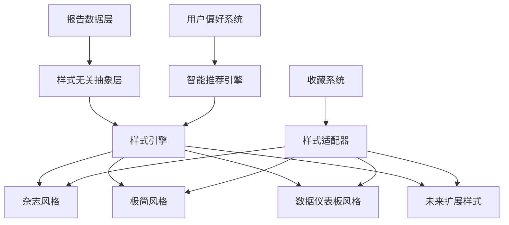

# 多样式报告页面设计文档

## 概述

这不是一个简单的功能添加，而是对报告体验的彻底重新定义。我们将创建一个多样式报告系统，每种样式都有独特的视觉语言、交互逻辑和情感体验。收藏功能不再是外加的按钮，而是每种设计语言的有机组成部分。

### 设计哲学

**"形式追随情感，功能服务体验"**

我们不满足于"能用就行"的标准。每个像素、每个交互、每个动画都必须有其存在的理由。我们要创造的不仅仅是界面，而是情感体验的载体。

## 架构设计

### 核心架构原则



### 数据结构设计

```typescript
interface ReportStyleSystem {
  // 样式无关的核心数据
  coreData: {
    reportId: string;
    content: ReportContent;
    metadata: ReportMetadata;
    generatedAt: string;
    userContext: UserContext;
  };
  
  // 样式特定的展示配置
  styleConfigs: {
    [styleName: string]: StyleConfiguration;
  };
  
  // 用户偏好和历史
  userPreferences: {
    preferredStyle: string;
    styleHistory: StyleUsageHistory[];
    personalizations: StylePersonalization[];
  };
}

interface StyleConfiguration {
  name: string;
  displayName: string;
  description: string;
  emotionalTone: 'professional' | 'casual' | 'playful' | 'intense';
  complexity: 'minimal' | 'moderate' | 'rich';
  favoriteIntegration: FavoriteIntegrationConfig;
  responsiveBreakpoints: ResponsiveConfig;
  animations: AnimationConfig;
}
```

## 三种核心样式设计

### 1. 杂志风格 (Magazine Style) - "权威专业"

**设计理念：** 像《经济学人》一样的权威感，但保持现代感

**视觉特征：**
- 经典的栅格系统，黄金比例布局
- 衬线字体标题 + 无衬线正文的经典组合
- 克制的色彩：深灰、米白、点缀色
- 大量留白，呼吸感强

**收藏集成：**
```jsx
// 杂志风格的收藏按钮 - 像书签一样自然
<MagazineBookmark 
  position="top-right-corner"
  style="leather-bookmark"
  animation="page-fold"
  states={{
    default: { color: '#8B7355', opacity: 0.7 },
    favorited: { color: '#D4AF37', opacity: 1.0 },
    hover: { transform: 'translateY(-2px)', shadow: 'soft' }
  }}
/>
```

**交互细节：**
- 收藏时：页面右上角出现书签折角效果
- 取消收藏：书签淡出，伴随纸张翻页音效
- 悬停状态：轻微的阴影和位移，模拟真实书签

### 2. 极简风格 (Minimal Style) - "纯粹专注"

**设计理念：** Dieter Rams的设计原则 - "少即是多"

**视觉特征：**
- 单色调设计，最多使用3种颜色
- 大量负空间，内容密度极低
- 无装饰性元素，每个元素都有功能性
- 字体：Inter或SF Pro，统一字重

**收藏集成：**
```jsx
// 极简风格的收藏 - 几乎隐形，但功能完整
<MinimalFavorite
  appearance="ghost"
  position="integrated-in-title"
  interaction="subtle-highlight"
  states={{
    default: { opacity: 0.3, size: '16px' },
    favorited: { opacity: 1.0, color: '#000' },
    hover: { opacity: 0.8, scale: 1.1 }
  }}
/>
```

**交互细节：**
- 收藏按钮融入标题行，不占用额外空间
- 状态变化通过透明度和颜色深度表达
- 无多余动画，变化瞬间完成

### 3. 数据仪表板风格 (Dashboard Style) - "信息密集"

**设计理念：** 像Bloomberg Terminal一样的信息密度和专业感

**视觉特征：**
- 深色主题，高对比度
- 数据可视化元素丰富
- 网格布局，信息密度高
- 荧光绿/蓝色点缀，科技感强

**收藏集成：**
```jsx
// 仪表板风格的收藏 - 像保存分析结果
<DashboardSaveAction
  style="terminal-button"
  position="action-bar"
  feedback="data-confirmation"
  states={{
    default: { 
      background: 'rgba(0,255,0,0.1)', 
      border: '1px solid #00ff00',
      text: 'SAVE ANALYSIS'
    },
    favorited: { 
      background: 'rgba(0,255,0,0.3)',
      text: 'ANALYSIS SAVED',
      icon: 'check-circle'
    }
  }}
/>
```

**交互细节：**
- 收藏按钮像终端命令一样的视觉反馈
- 成功状态显示"ANALYSIS SAVED"
- 伴随数据流动的视觉效果

## 样式切换系统设计

### 智能样式推荐

```typescript
class StyleRecommendationEngine {
  analyzeUserContext(user: User, reportContent: ReportContent): StyleRecommendation {
    const factors = {
      timeOfDay: this.getTimeContext(),
      deviceType: this.getDeviceContext(),
      reportComplexity: this.analyzeContentComplexity(reportContent),
      userHistory: this.getUserStyleHistory(user),
      currentMood: this.inferUserMood(user.recentActivity)
    };
    
    return this.calculateOptimalStyle(factors);
  }
  
  private calculateOptimalStyle(factors: ContextFactors): StyleRecommendation {
    // 早晨 + 移动设备 + 复杂报告 = 推荐极简风格
    // 晚上 + 桌面 + 详细分析 = 推荐杂志风格
    // 工作时间 + 多屏幕 + 数据密集 = 推荐仪表板风格
  }
}
```

### 样式切换界面

```jsx
<StyleSwitcher>
  <StylePreview 
    style="magazine"
    preview="实时缩略图预览"
    description="深度阅读，权威分析"
    estimatedReadTime="8-12分钟"
  />
  <StylePreview 
    style="minimal"
    preview="实时缩略图预览"
    description="快速浏览，核心要点"
    estimatedReadTime="3-5分钟"
  />
  <StylePreview 
    style="dashboard"
    preview="实时缩略图预览"
    description="数据密集，专业分析"
    estimatedReadTime="5-8分钟"
  />
</StyleSwitcher>
```

## 响应式设计策略

### 移动端优化

每种样式在移动端都有专门的优化版本，不是简单的缩放：

**杂志风格移动版：**
- 单列布局，保持阅读节奏
- 更大的字体，更宽的行距
- 收藏按钮变为浮动操作按钮

**极简风格移动版：**
- 更极致的简化，只保留核心信息
- 手势导航优先
- 收藏通过长按手势触发

**仪表板风格移动版：**
- 卡片式布局，可滑动查看
- 关键数据优先显示
- 收藏按钮集成在顶部操作栏

## 性能优化设计

### 渐进式加载

```typescript
class ProgressiveStyleLoader {
  async loadStyle(styleName: string, priority: 'critical' | 'important' | 'lazy') {
    // 1. 立即加载基础结构和关键CSS
    await this.loadCriticalCSS(styleName);
    
    // 2. 异步加载装饰性元素
    this.loadEnhancementCSS(styleName);
    
    // 3. 懒加载动画和交互效果
    this.loadInteractionCSS(styleName);
  }
}
```

### 样式缓存策略

- 用户偏好样式预加载
- 样式切换时的智能预测加载
- 离线样式缓存支持

## 可访问性设计

### 通用设计原则

每种样式都必须满足WCAG 2.1 AA标准：

```typescript
interface AccessibilityConfig {
  colorContrast: {
    normal: number; // 最低4.5:1
    large: number;  // 最低3:1
  };
  
  keyboardNavigation: {
    focusIndicators: 'visible' | 'high-contrast';
    tabOrder: 'logical';
    shortcuts: KeyboardShortcut[];
  };
  
  screenReader: {
    landmarks: boolean;
    headingStructure: 'hierarchical';
    alternativeText: 'descriptive';
  };
  
  reducedMotion: {
    respectPreference: boolean;
    fallbackAnimations: 'fade' | 'none';
  };
}
```

### 样式特定的可访问性

**杂志风格：**
- 高对比度版本可选
- 字体大小可调节
- 语音朗读优化的语义结构

**极简风格：**
- 天然的高可访问性
- 清晰的焦点指示器
- 简化的导航结构

**仪表板风格：**
- 数据表格的完整标签
- 图表的文字描述
- 高对比度模式

## 错误处理和降级策略

### 优雅降级

```typescript
class StyleFallbackSystem {
  handleStyleLoadFailure(requestedStyle: string): FallbackStrategy {
    const fallbackChain = [
      'cached-version',
      'simplified-version', 
      'basic-html-version',
      'text-only-version'
    ];
    
    return this.executeFallbackChain(fallbackChain);
  }
  
  handleDataInconsistency(reportData: ReportData): RecoveryAction {
    // 数据不完整时的智能修复
    // 保证用户体验不中断
  }
}
```

## 测试策略

### 视觉回归测试

```typescript
describe('样式系统视觉测试', () => {
  test('杂志风格在不同设备上的一致性', async () => {
    const devices = ['desktop', 'tablet', 'mobile'];
    for (const device of devices) {
      await expect(page).toMatchScreenshot(`magazine-${device}.png`);
    }
  });
  
  test('收藏按钮在所有样式中的交互状态', async () => {
    const styles = ['magazine', 'minimal', 'dashboard'];
    const states = ['default', 'hover', 'active', 'favorited'];
    
    for (const style of styles) {
      for (const state of states) {
        await testFavoriteButtonState(style, state);
      }
    }
  });
});
```

### 性能基准测试

- 样式切换时间 < 200ms
- 首次内容绘制 < 1.5s
- 交互响应时间 < 100ms
- 内存使用增长 < 10MB

## 未来扩展性

### 插件化样式系统

```typescript
interface StylePlugin {
  name: string;
  version: string;
  dependencies: string[];
  
  register(): void;
  render(data: ReportData): ReactElement;
  getFavoriteComponent(): ReactElement;
  getResponsiveConfig(): ResponsiveConfig;
}

class StyleRegistry {
  registerPlugin(plugin: StylePlugin): void {
    // 动态注册新样式
  }
  
  validatePlugin(plugin: StylePlugin): ValidationResult {
    // 确保插件符合设计标准
  }
}
```

### AI驱动的样式生成

未来可以基于用户行为和偏好，AI生成个性化的样式变体：

```typescript
interface AIStyleGenerator {
  generatePersonalizedStyle(
    user: User, 
    baseStyle: string,
    preferences: StylePreferences
  ): Promise<CustomStyle>;
  
  optimizeStyleForContent(
    content: ReportContent,
    userContext: UserContext
  ): Promise<StyleOptimization>;
}
```

## 实现优先级

### 第一阶段：核心架构
1. 样式系统基础架构
2. 三种核心样式的基础实现
3. 样式切换机制

### 第二阶段：收藏集成
1. 样式特定的收藏组件
2. 收藏状态同步
3. 交互动画和反馈

### 第三阶段：智能化
1. 样式推荐引擎
2. 用户偏好学习
3. 性能优化

### 第四阶段：完善体验
1. 可访问性完整实现
2. 错误处理和降级
3. 测试覆盖和文档

---

**这不是一个功能的添加，而是一次体验的革命。我们要创造的不仅仅是界面，而是情感的载体、思考的工具、美的体现。**