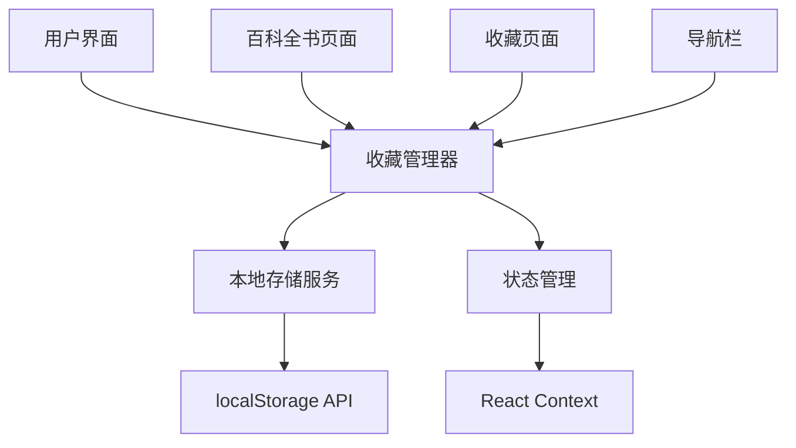

# 用户收藏系统设计文档

## 概述

用户收藏系统是一个基于浏览器本地存储的功能，允许用户收藏和管理他们喜欢的作物和宠物。系统设计注重简单性、性能和用户体验。

## 架构

### 系统架构图



### 技术栈
- **前端框架**: React 18 + Next.js 14
- **状态管理**: React Context + useState/useEffect
- **数据存储**: Browser localStorage API
- **样式**: Tailwind CSS
- **图标**: Lucide React

## 组件和接口

### 1. 核心组件

#### FavoritesProvider (Context Provider)
```typescript
interface FavoritesContextType {
  favorites: FavoritesData;
  addToFavorites: (itemId: string, type: 'crops' | 'pets') => void;
  removeFromFavorites: (itemId: string, type: 'crops' | 'pets') => void;
  isFavorite: (itemId: string, type: 'crops' | 'pets') => boolean;
  getFavoriteCount: () => number;
  clearAllFavorites: () => void;
}
```

#### FavoriteButton (收藏按钮组件)
```typescript
interface FavoriteButtonProps {
  itemId: string;
  itemType: 'crops' | 'pets';
  size?: 'sm' | 'md' | 'lg';
  showLabel?: boolean;
}
```

#### FavoritesPage (收藏页面组件)
```typescript
interface FavoritesPageProps {
  // 无需props，从context获取数据
}
```

#### FavoritesBadge (收藏数量徽章)
```typescript
interface FavoritesBadgeProps {
  count: number;
  showZero?: boolean;
}
```

### 2. 工具函数

#### localStorage 管理
```typescript
class FavoritesStorage {
  static save(favorites: FavoritesData): void;
  static load(): FavoritesData;
  static clear(): void;
  static isSupported(): boolean;
}
```

## 数据模型

### 收藏数据结构
```typescript
interface FavoritesData {
  crops: string[];
  pets: string[];
  lastUpdated: string;
}

interface FavoriteItem {
  id: string;
  name: string;
  displayName: string;
  tier: string;
  type: 'crops' | 'pets';
  addedAt: string;
}
```

### 默认数据
```typescript
const DEFAULT_FAVORITES: FavoritesData = {
  crops: [],
  pets: [],
  lastUpdated: new Date().toISOString()
};
```

## 用户界面设计

### 1. 收藏按钮设计

#### 未收藏状态
```
┌─────────────────┐
│ ♡ Add to Favorites │
└─────────────────┘
```

#### 已收藏状态
```
┌─────────────────┐
│ ♥ Favorited     │
└─────────────────┘
```

#### 小尺寸版本（用于卡片）
```
┌───┐
│ ♡ │  或  │ ♥ │
└───┘      └───┘
```

### 2. 收藏页面布局

```
┌─────────────────────────────────────────────────────────┐
│ 🔖 My Favorites                                         │
│ You have 12 favorites (8 crops, 4 pets)                │
├─────────────────────────────────────────────────────────┤
│ 🌱 Crops (8)                                           │
│ ┌───┐ ┌───┐ ┌───┐ ┌───┐ ┌───┐ ┌───┐ ┌───┐ ┌───┐     │
│ │🥕 │ │🍓 │ │🫐 │ │🌹 │ │🌷 │ │...│ │...│ │...│     │
│ └───┘ └───┘ └───┘ └───┘ └───┘ └───┘ └───┘ └───┘     │
├─────────────────────────────────────────────────────────┤
│ 🐾 Pets (4)                                            │
│ ┌───┐ ┌───┐ ┌───┐ ┌───┐                               │
│ │🐱 │ │🐶 │ │🐰 │ │🐸 │                               │
│ └───┘ └───┘ └───┘ └───┘                               │
└─────────────────────────────────────────────────────────┘
```

### 3. 空状态设计

```
┌─────────────────────────────────────────────────────────┐
│                    🔖                                   │
│              No Favorites Yet                           │
│                                                         │
│        Start exploring crops and pets to build         │
│              your personal collection!                  │
│                                                         │
│    ┌─────────────────┐  ┌─────────────────┐           │
│    │ Browse Crops    │  │ Browse Pets     │           │
│    └─────────────────┘  └─────────────────┘           │
└─────────────────────────────────────────────────────────┘
```

### 4. 导航栏集成

```
┌─────────────────────────────────────────────────────────┐
│ 🏠 Home  📚 Encyclopedia  🔖 Favorites (3)  ⚙️ Settings │
└─────────────────────────────────────────────────────────┘
```

## 错误处理

### localStorage 不可用
```typescript
if (!FavoritesStorage.isSupported()) {
  // 显示警告消息
  // 使用内存存储作为fallback
  // 提示用户启用localStorage
}
```

### 数据损坏处理
```typescript
try {
  const favorites = FavoritesStorage.load();
} catch (error) {
  console.warn('Favorites data corrupted, resetting...');
  FavoritesStorage.clear();
  return DEFAULT_FAVORITES;
}
```

### 存储空间不足
```typescript
try {
  FavoritesStorage.save(favorites);
} catch (error) {
  if (error.name === 'QuotaExceededError') {
    // 提示用户清理浏览器数据
    // 或提供导出功能
  }
}
```

## 测试策略

### 单元测试
- FavoritesStorage 类的所有方法
- 收藏状态管理逻辑
- 数据验证和错误处理

### 集成测试
- 收藏按钮点击行为
- 页面间状态同步
- localStorage 持久化

### 用户体验测试
- 收藏/取消收藏流程
- 收藏页面导航
- 响应式设计验证
- 空状态和错误状态

## 性能考虑

### 优化策略
1. **懒加载**: 收藏页面组件按需加载
2. **防抖**: 收藏操作防抖处理，避免频繁存储
3. **缓存**: 内存中缓存收藏状态，减少localStorage读取
4. **批量操作**: 支持批量添加/移除收藏

### 内存管理
```typescript
// 使用 useMemo 缓存计算结果
const favoriteItems = useMemo(() => {
  return items.filter(item => isFavorite(item.id, item.type));
}, [items, favorites]);
```

## 可访问性

### 键盘导航
- 收藏按钮支持 Tab 键导航
- 支持 Enter 和 Space 键操作
- 收藏页面支持方向键导航

### 屏幕阅读器
- 收藏按钮有适当的 aria-label
- 收藏状态变化有语音反馈
- 收藏数量有语义化描述

### 视觉设计
- 收藏状态有明显的视觉区别
- 支持高对比度模式
- 颜色不是唯一的状态指示器

## 国际化支持

### 文本内容
```typescript
const i18n = {
  'en': {
    'favorites': 'Favorites',
    'addToFavorites': 'Add to Favorites',
    'removeFromFavorites': 'Remove from Favorites',
    'noFavorites': 'No Favorites Yet'
  },
  'zh': {
    'favorites': '收藏',
    'addToFavorites': '添加到收藏',
    'removeFromFavorites': '从收藏中移除',
    'noFavorites': '暂无收藏'
  }
};
```

## 未来扩展

### 第二阶段功能
1. **收藏分组**: 用户自定义收藏夹
2. **收藏笔记**: 为收藏物品添加个人笔记
3. **收藏分享**: 生成分享链接
4. **导入导出**: JSON格式的收藏数据

### 第三阶段功能
1. **用户账户**: 跨设备同步
2. **收藏统计**: 收藏趋势分析
3. **推荐系统**: 基于收藏的智能推荐
4. **社交功能**: 查看其他用户的公开收藏